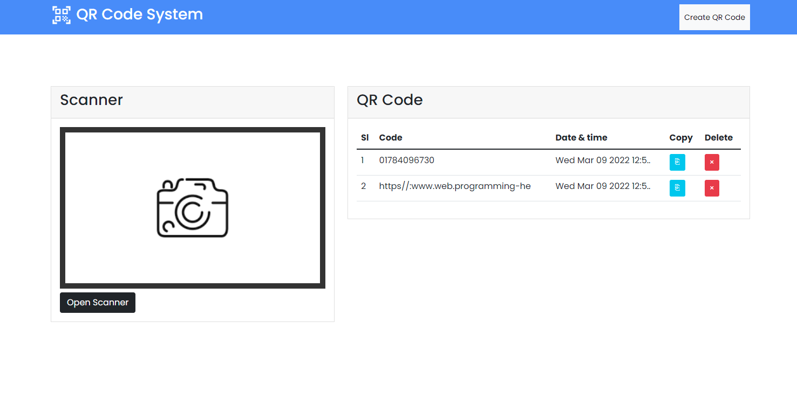

# QR Code System using Vanilla JavaScript.

This is simple QR Code Scanner with Generator. Here You will create a QR Code & Scan as well. If you have a better idea then it please feel free to make of your idea as code.

# Using Technologies
- HTML5/HTML
- CSS3/CSS
- Bootstrap Framework
- Github/Git bash
- Windows Terminal
- Browser API (LocalStorage)
- Google Fonts (poppins)
- Qr code from google
- Scanner from google
- VS Code Editor
& many more..

# Required Features
- You will create a QR Code
- & also can scan your created QR code
- & also can save of your QR code into browser LocalStorage
- & also can delete qr code in terms of confirmation
- also can copy QR code by clicking the button

# Live link - 
# Demo preview for this project

> Thanks for reach out me on github.